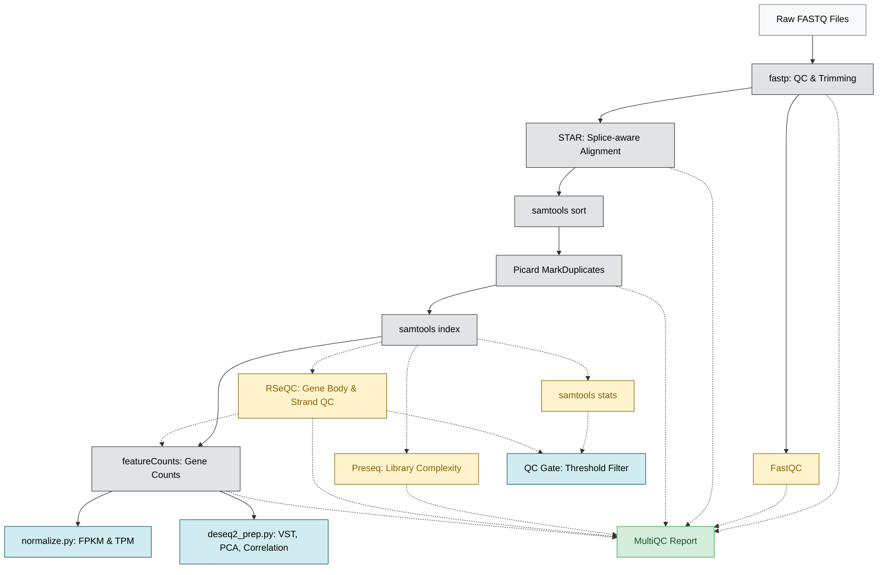

# BDB-Genomics RNA-seq Pipeline

A production-grade, config-driven Snakemake pipeline for paired-end bulk RNA-seq.

Takes raw FASTQ files and produces QC reports, a gene count matrix, normalized counts, PCA, and sample correlation — ready for differential expression analysis.

Runs on local machines, HPC clusters (SLURM), and Cloud (GCP, AWS, Azure, Kubernetes).

---

## Pipeline DAG



**Solid lines** = core DAG (must run in order). **Dotted lines** = QC side-branches (run in parallel).

---

## Quick Start

Requires **Snakemake 8.0+** and Conda/Mamba.

### 1. Configure

Edit `config.yaml` with your paths, parameters, and sample sheet location (`data/samples.tsv`).

### 2. Run

```bash
# Local — 8 cores
scripts/run_pipeline.sh -c 8 -- --profile profiles/local

# HPC — SLURM cluster
scripts/run_pipeline.sh -- --profile profiles/slurm

# Cloud — Google Cloud Batch
scripts/run_pipeline.sh -- --profile profiles/gcp
```

---

## Repository Map

| Directory | Contents |
|---|---|
| [`rules/`](rules/) | Modular `.smk` rule files (one per tool) |
| [`rules/scripts/`](rules/scripts/) | Python scripts for validation, QC gating, normalization, and analytics |
| [`rules/envs/`](rules/envs/) | Modular Conda environments (one per tool, version-pinned) |
| [`scripts/`](scripts/) | Bash wrappers for pipeline execution |
| [`profiles/`](profiles/) | Execution profiles for Local, SLURM, GCP, AWS, Azure, Kubernetes |
| [`envs/`](envs/) | Grouped Conda environments for interactive debugging |
| [`AGENTS.md`](AGENTS.md) | AI agent navigation and tooling entry point |

---

## Strandedness Auto-Detection

The pipeline automatically detects library strandedness by parsing RSeQC `infer_experiment.py` output.

All samples in a batch must share the same strandedness. If they do not, the pipeline raises a `ValueError` and stops immediately. This prevents `featureCounts` from silently producing incorrect counts.

You can configure this in `config.yaml` under `featurecounts` → `params`:

| Parameter | Default | What it does |
|---|---|---|
| `strandedness_threshold` | `0.8` | Fraction above which a sample is classified as stranded |
| `strandedness_fallback` | `2` | Default value used in CI mode (`0` = unstranded, `1` = forward, `2` = reverse) |

These thresholds are pipeline conventions, not biological constants. Adjust them based on your data.

---

## Fail-Safe Design

| Mechanism | Description |
|---|---|
| **Pre-flight Validation** | `validate_config.py` checks all config keys, types, and file paths before any job runs |
| **Strict Conda Isolation** | Each rule uses its own pinned Conda environment to prevent dependency conflicts |
| **Fail-Fast on Core Parameters** | Mismatched strandedness or missing inputs crash the pipeline immediately with a clear error |
| **Graceful Degradation on Analytics** | Analytics scripts (PCA, correlation) write placeholder outputs if data is insufficient, rather than crashing |
| **Dynamic Resource Scaling** | Memory and time allocations scale with input size and retry attempts |