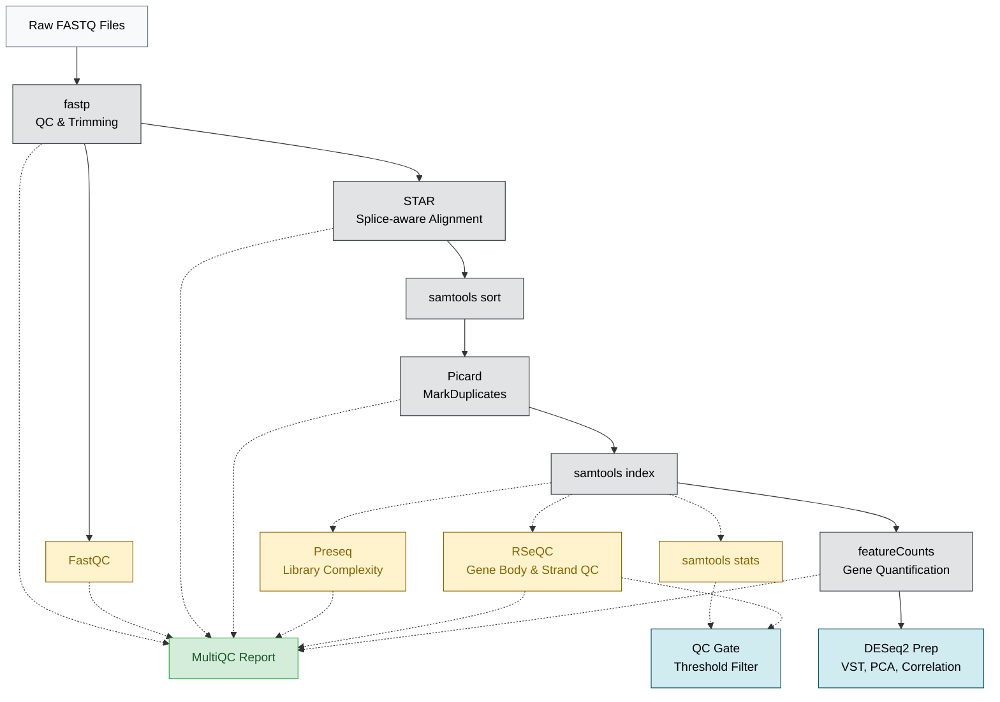

# BDB-Genomics RNA-seq Pipeline

A production-grade, config-driven Snakemake framework for paired-end bulk RNA-seq processing. 

Built for resilience, it handles the full lifecycle from raw FASTQ reads through splice-aware alignment, transcript quantification, and differential expression prep, while automatically scaling from local machines to HPC clusters and Cloud instances.

---

## 🏗️ Pipeline Architecture



---

## 🚀 Quick Start

The pipeline relies on **Snakemake 8.0+** and uses a wrapper script to bootstrap execution seamlessly.

### 1. Configure the Run
Edit `config.yaml` to specify your parameters and ensure your metadata is in `data/fastp/samples.tsv`.

### 2. Execute
Run the pipeline using the wrapper script, which handles environment detection, pre-flight validation, and execution profiles automatically:

```bash
# Run locally using 8 cores
scripts/run_pipeline.sh -c 8 -- --profile profiles/local

# Run on an HPC cluster using SLURM
scripts/run_pipeline.sh -- --profile profiles/slurm

# Run in the Cloud (e.g., Google Cloud Batch)
scripts/run_pipeline.sh -- --profile profiles/gcp
```

---

## 📁 Repository Documentation Map

For detailed architectural information, please consult the specific `README.md` files located in each foundational directory:

| Directory | What you will find there |
|---|---|
| [`profiles/`](profiles/) | Cloud, SLURM, and local execution configuration profiles |
| [`scripts/`](scripts/) | Pipeline orchestration and execution wrappers |
| [`envs/`](envs/) | Grouped, multi-tool Conda environments for manual debugging |
| [`rules/envs/`](rules/envs/) | Strict, 1-to-1 modular Conda environments for automated rules |
| [`rules/`](rules/) | Modular `.smk` files and dependency flowcharts |
| [`AGENTS.md`](AGENTS.md) | Agent context for the Understand-Anything plugin and Open-Wiki integration |

---

## 🔒 Security & Fail-Safes

| Mechanism | Description |
|---|---|
| **Pre-flight Validation** | The `scripts/` wrapper enforces configuration validation *before* execution. |
| **Strict Isolation** | `rules/envs/` guarantees completely isolated tool executions. |
| **Defensive Analytics** | Analytics scripts gracefully write placeholder outputs instead of crashing when biological data yields extreme outliers. |

---

## 🧬 Strandedness Auto-Detection

The pipeline automatically infers library strandedness by parsing the output of RSeQC `infer_experiment.py`.

You can tune the classification parameters in `config.yaml` under `featurecounts` ➔ `params`:
*   `strandedness_threshold`: The fraction threshold above which a library is confidently classified as stranded (default: `0.8`).
*   `strandedness_fallback`: The default fallback value (`0` = unstranded, `1` = forward, `2` = reverse) used in CI mode or if reports are missing/empty (default: `2`).

These thresholds are empirical pipeline conventions used to prevent silent counting degradation, rather than fixed biological constants. Adjust them based on your dataset's specific noise levels.