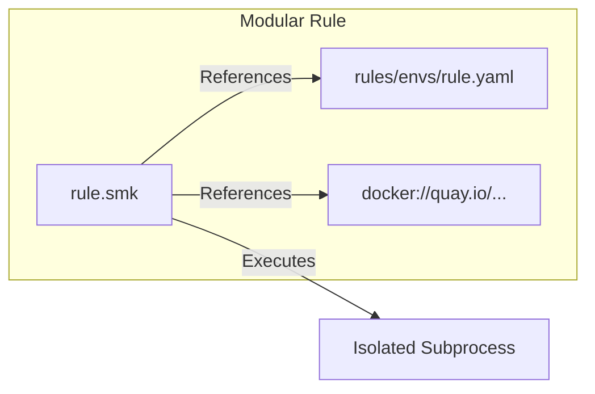
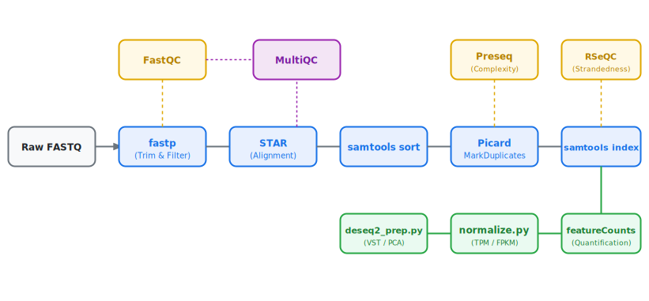
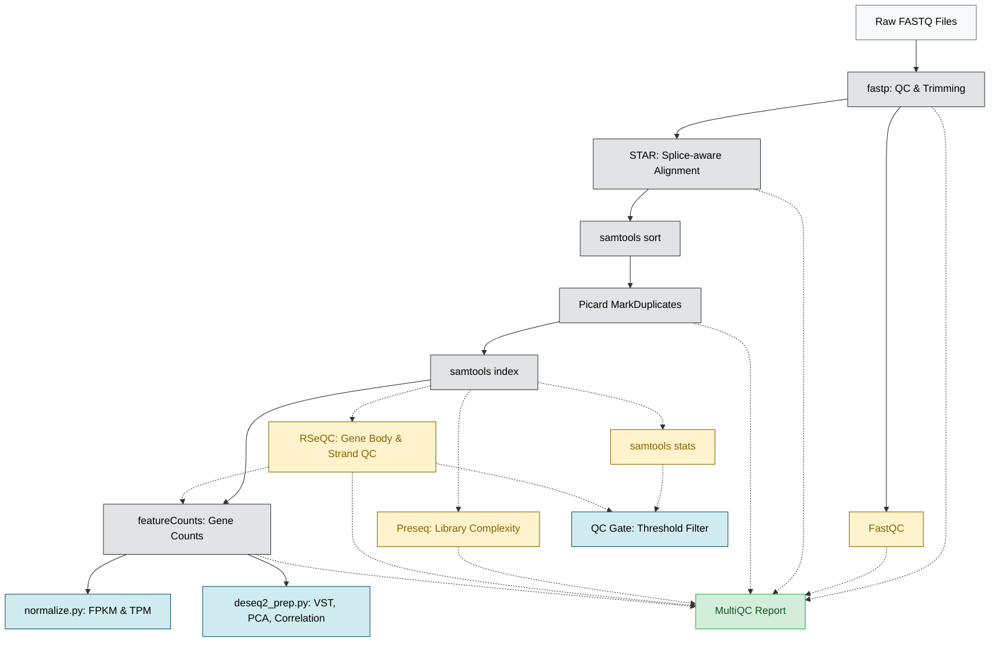

# BDB-Genomics RNA-seq Pipeline

A production-grade, config-driven, and fully modular Snakemake pipeline for bulk RNA-seq analysis.

This pipeline automates the standard bulk RNA-seq workflow: raw FASTQ quality control, adapter trimming, splice-aware alignment, duplicate marking, library complexity estimation, strandedness auto-detection, feature quantification, and downstream analytics (normalization, PCA, and sample correlation).

---

## Modular Architecture & Swappability

Unlike traditional monolithic shell scripts or tightly bound pipeline orchestrators, this pipeline is designed around **strict modularity**.

### Key Architectural Pillars
1. **Rule Isolation:** Every tool in the workflow is defined in its own standalone `.smk` file within the [`rules/`](rules/) directory.
2. **Conda Sandboxing:** Each rule specifies its own version-pinned, isolated Conda environment file in [`rules/envs/`](rules/envs/). Dependencies for one tool never conflict with another.
3. **Execution Agnosticism:** Rules are environment-agnostic. The pipeline automatically switches between Conda environments, local paths, or Singularity/Apptainer containers without modifying rule logic.



### Swapping Components
Because of this modular design, you can easily swap out components of the workflow without breaking the pipeline. For example:
* **Alignment:** Swap **STAR** for **HISAT2** or **minimap2** by adding a new alignment rule and updating the input/output paths.
* **Quantification:** Swap **featureCounts** for pseudo-aligners like **Salmon** or **Kallisto** by editing the quantification rule.
* **Downstream Analysis:** Replace **DESeq2** preparation with **EdgeR** or **Limma-Voom** scripts.

As long as the new rule satisfies the input/output file naming conventions expected by downstream rules, the pipeline remains fully functional.

---



The Directed Acyclic Graph (DAG) below shows the flow of data through the pipeline:



* **Solid lines** represent the core sequential workflow (must run in order).
* **Dotted lines** represent quality control and validation side-branches (run in parallel).

---

## Detailed Execution Guide

The pipeline supports multiple execution modes depending on your infrastructure.

### Prerequisites
* **Snakemake 8.0+**
* **Conda** or **Mamba** (highly recommended for local env resolution)
* **Apptainer / Singularity** (required for containerized runs)

---

### Setup & Configuration

1. **Format your Sample Sheet:**
   Create a tab-separated file at `data/samples.tsv` listing your samples and FASTQ file locations:
   ```tsv
   sample	fq1	fq2
   sample1	data/fastq/sample1_R1.fastq.gz	data/fastq/sample1_R2.fastq.gz
   sample2	data/fastq/sample2_R1.fastq.gz	data/fastq/sample2_R2.fastq.gz
   ```
   *For single-end runs, leave the `fq2` column empty or omit it.*

2. **Configure Run Parameters:**
   Modify `config.yaml` to specify reference genomes, annotation files, and tool-specific parameters.

---

### Execution Methods

#### Method 1: Using the Wrapper Script (Recommended)
The [`scripts/run_pipeline.sh`](scripts/run_pipeline.sh) wrapper automates pre-flight validation, directory locking/unlocking, and logging.

* **Local Conda Execution:**
  ```bash
  scripts/run_pipeline.sh -c 8 -- --profile profiles/local
  ```
* **Local Singularity/Apptainer Execution:**
  ```bash
  scripts/run_pipeline.sh -c 8 -- --profile profiles/test_singularity
  ```
* **Dry-Run (Validation):**
  ```bash
  scripts/run_pipeline.sh -n
  ```
* **Submit to SLURM HPC Cluster:**
  ```bash
  scripts/run_pipeline.sh -- --profile profiles/slurm
  ```

#### Method 2: Direct Snakemake Command Execution
For full control, execute Snakemake directly from the repository root:

* **Local execution with Conda (Mamba frontend):**
  ```bash
  snakemake --use-conda --conda-frontend mamba --cores 8 --profile profiles/local
  ```
* **Containerized execution with Apptainer/Singularity:**
  ```bash
  snakemake --use-singularity --cores 8 --profile profiles/test_singularity
  ```
* **Running a Single-End Workflow:**
  Pass the single-end configuration file to override the default paired-end layout:
  ```bash
  snakemake --use-conda --cores 8 --configfile profiles/test/config_se.yaml
  ```
* **Overriding Configurations via Command Line:**
  You can override any parameter in `config.yaml` directly on the command line using `--config`:
  ```bash
  snakemake --cores 4 --config fastqc:threads=2 star:threads=4
  ```

---

### Cloud Deployments

The pipeline includes built-in execution profiles for major cloud orchestrators inside the `profiles/` directory:

| Environment | Command | Executor Plugin | Storage |
|---|---|---|---|
| **Google Cloud** | `snakemake --profile profiles/gcp` | Google Batch | Cloud Storage (`gs://`) |
| **AWS** | `snakemake --profile profiles/aws` | AWS Batch | S3 Storage (`s3://`) |
| **Azure** | `snakemake --profile profiles/azure` | Azure Batch | Blob Storage |
| **Kubernetes** | `snakemake --profile profiles/kubernetes` | Kubernetes | Persistent Volumes |

---

## Fail-Safe Design & Guardrails

* **Pre-flight Schema Check:** Before any jobs are scheduled, `validate_config.py` validates the format of `config.yaml`, checks that all required input files exist, and verifies that the sample sheet columns are correct.
* **Layout-Consistency Guardrail (Strandedness):** The pipeline automatically detects library strandedness using RSeQC's `infer_experiment.py`. If it detects mismatched strandedness values across different samples in the same batch, it raises a `ValueError` and terminates execution to prevent downstream errors.
* **Resource Scaling & Retries:** High-resource rules (like STAR alignment or Picard MarkDuplicates) have dynamic retry resources. If a job fails due to out-of-memory errors, Snakemake retries it automatically with scaled-up memory and threads.

---

## Architectural Visualization (Draw.io)

For a fully interactive, editable schematic of the pipeline architecture, please refer to the Draw.io file located at:
* **[docs/architecture.drawio](docs/architecture.drawio)**

You can import this file directly into [draw.io](https://app.diagrams.net/) to inspect, modify, or export the flowchart.

---

## Scientific Validation & Reference Standards

This pipeline's design choices are validated against established guidelines in bulk transcriptomics. Below is a comparison contrasting our implementation against literature recommendations, demonstrating how the **modular design** allows key differences to be swapped out without breaking the workflow:

| Reference Standard | Recommendation | Our Implementation | Modularity & Swap Path (Architecture Safe) |
|---|---|---|---|
| **Conesa et al. (2016)**<br>*Best Practices for RNA-seq* | Multi-stage QC, splice-aware alignment, quantification, and downstream normalization. | Features fastp, FastQC, STAR, featureCounts, and DESeq2 preparation. | **Fully modular.** Rules for trimming, mapping, or counting are independent and can be individually updated. |
| **Soneson et al. (2021)** / **nf-core v3.x** | Transcript/isoform-level quantification using pseudo-aligners. | Primary quantification via `featureCounts` at the gene level. | **Easily swappable.** You can swap `featurecounts.smk` for `Salmon` or `Kallisto` rules without modifying downstream analytic scripts. |
| **Love et al. (2014)**<br>*DESeq2 Framework* | Run differential expression on raw counts; use VST/rlog only for visualization (PCA/correlation). | Raw featureCounts go directly to DESeq2; VST normalized values are used for PCA. | **Separation of concerns.** Count generation and normalization scripts are decoupled from downstream DE pipelines. |
| **Wang et al. (2012)**<br>*RSeQC Toolkit* | Quality control checks on strandedness, gene coverage, and junction saturation. | Auto-strandedness detection dynamically updates rules using RSeQC output. | **Decoupled validation.** Strandedness auto-detection helper runs prior to quantification to ensure input accuracy. |
| **StackExchange Consensus** | Do not filter PCR duplicates for bulk RNA-seq differential expression unless using UMIs. | Picard marks PCR duplicates for QC assessment but keeps them for gene quantification. | **Config-driven.** The duplication policy is handled by rule flags and can be adjusted in `config.yaml` without editing code. |

### Citing Pipeline Components

If you use this pipeline in your research, please cite:

* **Snakemake:** Mölder et al., 2021 (*F1000Research*)
* **fastp:** Chen et al., 2018 (*Bioinformatics*)
* **FastQC:** Andrews S., 2010 (*Babraham Bioinformatics*)
* **STAR:** Dobin et al., 2013 (*Bioinformatics*)
* **samtools:** Danecek et al., 2021 (*GigaScience*)
* **Picard:** Broad Institute, 2019 (*GitHub Repository*)
* **Preseq:** Daley and Smith, 2013 (*Nature Methods*)
* **RSeQC:** Wang et al., 2012 (*Bioinformatics*)
* **featureCounts:** Liao et al., 2014 (*Bioinformatics*)
* **DESeq2:** Love et al., 2014 (*Genome Biology*)
* **MultiQC:** Ewels et al., 2016 (*Bioinformatics*)