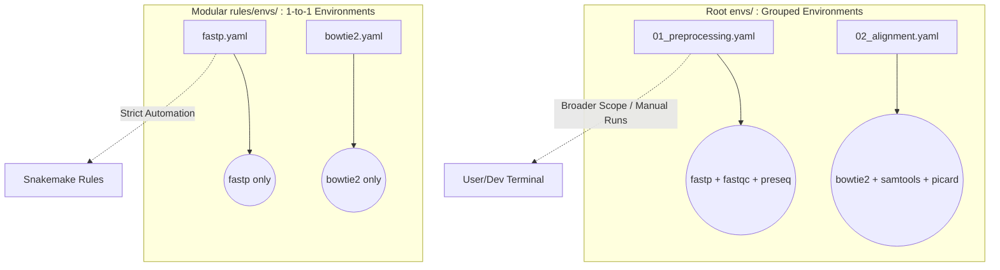

# Pipeline Environments (Grouped)

This directory contains the pipeline's **Grouped Conda Environments**. These environments bundle multiple tools together by pipeline stage.

---

## 🏗️ Environment Architecture (Grouped vs. Modular)

---

## 📁 Directory Reference

| Environment Group | Purpose | Typical Tools Bundled |
|---|---|---|
| **`01_preprocessing/`** | Quality control and adapter trimming | `fastp`, `fastqc`, `preseq`, `multiqc` |
| **`02_alignment/`** | Read mapping and BAM processing | `bowtie2`, `star`, `samtools`, `picard` |
| **`03_post_alignment/`** | Filtering and coverage tracks | `bedtools`, `deepTools`, `ucsc-bedgraphtobigwig` |
| **`04_metrics_qc/`** | Advanced pipeline metrics | `rseqc`, `qualimap`, `phantompeakqualtools` |
| **`05_peak_calling/`** | Variant/Peak identification | `macs2`, `seacr`, `homer` |
| **`06_visualization/`** | Plotting and differential analytics | `R`, `DESeq2`, `ChIPseeker`, `ggplot2` |
| **`main.yaml`** | Snakemake runner environment | `snakemake`, `mamba`, `pandas` |

---

## 🔒 When to use `envs/` vs `rules/envs/`

> [!TIP]
> **Use `envs/` (This Directory)** when you are running tools interactively in the terminal, debugging a stage manually, or want a bloated environment with many tools available at once.
> 
> **Use `rules/envs/`** inside the `.smk` Snakemake files. The pipeline execution *strictly* relies on modular 1-to-1 environments to guarantee reproducible, fail-safe isolation for every job.
