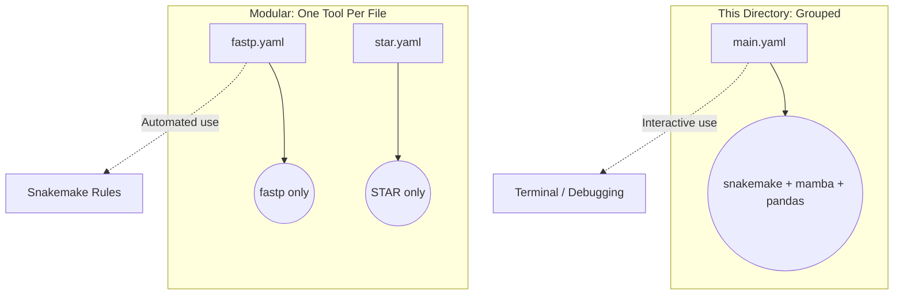

# Pipeline Environments (Grouped)

This directory contains **grouped** Conda environments. These bundle multiple tools together for interactive terminal use.

---

## Grouped vs Modular

---

## Files

| File | What it contains | When to use it |
|---|---|---|
| `main.yaml` | `snakemake`, `mamba`, `pandas` | Activating the Snakemake runner environment before launching the pipeline |

---

## When to Use Which

| Scenario | Use |
|---|---|
| Running the pipeline | `envs/main.yaml` to get Snakemake. Each rule then uses its own env from `rules/envs/`. |
| Debugging a tool interactively | `envs/main.yaml` or install the tool manually. |
| Adding a new rule | Create a new YAML in `rules/envs/`, not here. |

> [!TIP]
> **This directory** is for humans working in the terminal.
> **`rules/envs/`** is for Snakemake automation. Keep them separate.
