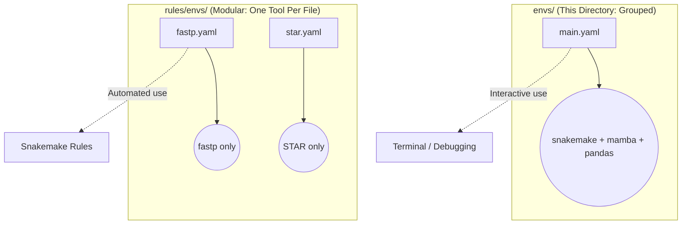

# Root-Level Environments (Grouped)

This directory contains **grouped** Conda environments. These bundle multiple workflow orchestration tools together for interactive terminal use.

---

## Grouped vs Modular Environments

---

## Environment Files

| File | Packages Included | Purpose |
|---|---|---|
| `main.yaml` | `snakemake`, `mamba`, `pandas`, `pyyaml`, `pulp`, `pytest` | Installs the core Snakemake runner environment. Run `conda env create -f envs/main.yaml` before launching the pipeline for the first time. |

---

## Guidance for Developers

* **When executing the pipeline:** Activate the root `envs/main.yaml` environment to run the Snakemake controller. Snakemake will automatically resolve and download the modular rule environments located in `rules/envs/`.
* **When debugging tools:** Use the root environment or install them manually inside a temporary test environment.
* **When writing a new rule:** Create a new rule-level environment in `rules/envs/<tool>.yaml`. Do **not** add dependencies to `envs/main.yaml` unless the Snakemake controller itself requires them (e.g., config parsing libraries).
