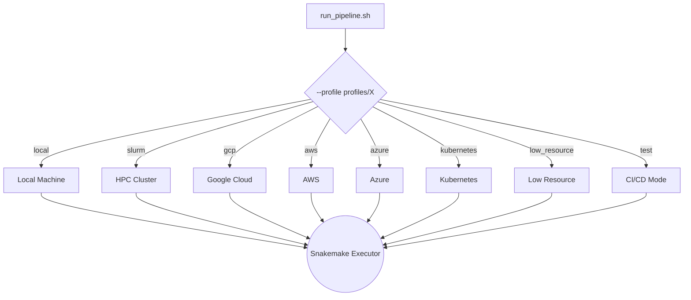

# Snakemake Execution Profiles

Each subdirectory here contains a `config.yaml` that tells Snakemake how to run: how many cores, which executor plugin to use, retry logic, and resource defaults.

---

## How Profiles Work

---

## Available Profiles

| Profile | Use Case | Executor Plugin | Storage |
|---|---|---|---|
| `local/` | Workstation or laptop | `local` | Local filesystem |
| `slurm/` | HPC cluster with SLURM scheduler | `slurm` | Shared filesystem (NFS/Lustre) |
| `gcp/` | Google Cloud Platform | `googlebatch` | Google Cloud Storage (`gs://`) |
| `aws/` | Amazon Web Services | `aws-batch` | AWS S3 Bucket (`s3://`) |
| `azure/` | Microsoft Azure | `azure-batch` | Azure Blob Storage |
| `kubernetes/` | Container orchestration (any cloud) | `kubernetes` | Persistent Volume Claim (PVC) |
| `low_resource/` | Machines with limited memory/cores | `local` | Local filesystem |
| `test/` | GitHub Actions / CI/CD pipeline | `local` | Local filesystem |
| `test_singularity/` | CI/CD container tests | `local` (with `--use-singularity`) | Local filesystem |

---

## What Profiles Control

1. **Executor Plugin:** Decides where jobs execute (`local`, `slurm`, `googlebatch`, etc.).
2. **Concurrent Jobs:** Sets the limit on simultaneous tasks (e.g., `jobs: 100` on SLURM).
3. **Retry Rules:** Configures automatic job retries (e.g., `restart-times: 3`).
4. **Default Resources:** Specifies fallback memory, threads, and runtime for rules without custom specifications.
5. **Storage Configuration:** Paths and prefixes for cloud buckets.

---

## Override Precedence

When running the pipeline:
1. The default values inside the rule files are loaded.
2. The values defined in the profile directory's `config.yaml` override those defaults.
3. Any command-line parameters (like `--cores 16` or `--config param=value`) override both the profile and the defaults.
