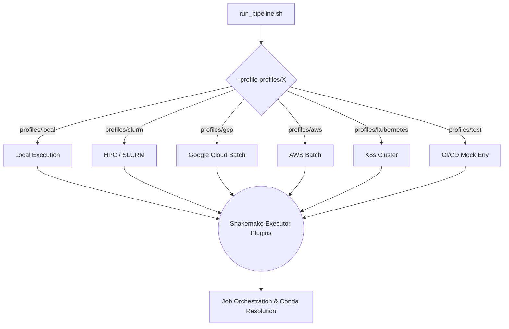

# Snakemake Execution Profiles

This directory contains the Snakemake profiles used to configure and orchestrate the pipeline across diverse compute environments. Instead of passing dozens of command-line arguments to Snakemake, you define your deployment strategy here and invoke it seamlessly.

---

## 🏗️ Deployment Architecture

---

## 📁 Profile Reference

Use these profiles via the pipeline execution script. Example: `scripts/run_pipeline.sh -- --profile profiles/slurm`

| Profile Directory | Use Case | Executor Plugin | Storage Scheme |
|---|---|---|---|
| **`local/`** | Testing or running on a powerful single machine (Mac/Linux workstation). | `local` | Native Filesystem |
| **`slurm/`** | Traditional High-Performance Computing clusters (academic/enterprise). | `slurm` | Native / Shared Storage |
| **`gcp/`** | Massive horizontal scaling on Google Cloud Platform. | `googlebatch` | `GS://` (Google Storage) |
| **`aws/`** | Massive horizontal scaling on Amazon Web Services. | `aws-batch` | `S3://` (AWS S3) |
| **`azure/`** | Massive horizontal scaling on Microsoft Azure. | `azure-batch` | `AzBlob://` |
| **`kubernetes/`** | Vendor-agnostic container orchestration. | `kubernetes` | PVC / Native |
| **`low_resource/`** | Very old hardware or extreme constraints (limits CPU/RAM globally). | `local` | Native Filesystem |
| **`test/`** | GitHub Actions and CI/CD validation. Skips retries, forces dry-runs/mocks. | `local` | Native Filesystem |

---

## ⚙️ How It Works (Snakemake 8.0)

Snakemake 8.0 deprecated the old profile system in favor of **Executor Plugins**. 

Each profile directory contains a `config.yaml` file. When you pass `--profile profiles/<name>`, Snakemake parses that YAML to determine:
1. **The Plugin**: `executor: slurm` or `executor: googlebatch`
2. **Global Rules**: Maximum concurrent jobs (`jobs: 100`), retry logic (`restart-times: 3`).
3. **Remote Storage**: The `default-remote-provider` and `default-remote-prefix` (crucial for Cloud deployments).
4. **Default Resources**: Fallback Memory and CPU requests if a specific `rule` doesn't define them.
