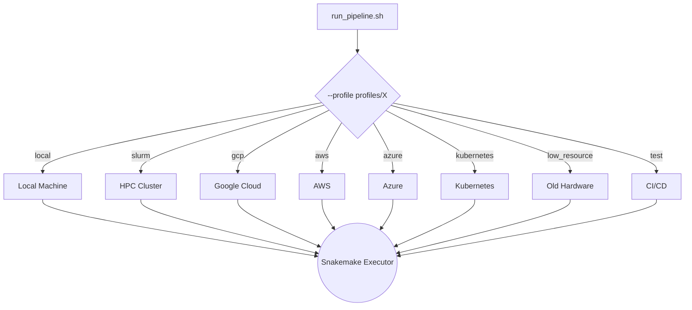

# Snakemake Execution Profiles

Each subdirectory here contains a `config.yaml` that tells Snakemake how to run: how many cores, which executor plugin, retry logic, and resource defaults.

---

## How Profiles Work



---

## Available Profiles

| Profile | Use case | Executor | Storage |
|---|---|---|---|
| `local/` | Single machine (workstation, laptop) | `local` | Local filesystem |
| `slurm/` | HPC cluster with SLURM scheduler | `slurm` | Shared filesystem |
| `gcp/` | Google Cloud Platform | `googlebatch` | `gs://` (GCS) |
| `aws/` | Amazon Web Services | `aws-batch` | `s3://` (S3) |
| `azure/` | Microsoft Azure | `azure-batch` | Azure Blob |
| `kubernetes/` | Container orchestration (any cloud) | `kubernetes` | PVC |
| `low_resource/` | Very limited CPU/RAM | `local` | Local filesystem |
| `test/` | GitHub Actions / CI/CD | `local` | Local filesystem |

---

## Usage

```bash
scripts/run_pipeline.sh -- --profile profiles/slurm
```

---

## What Each Profile Controls

Each `config.yaml` sets:

1. **Executor plugin** — `local`, `slurm`, `googlebatch`, etc.
2. **Max concurrent jobs** — e.g., `jobs: 100`
3. **Retry logic** — e.g., `restart-times: 3`
4. **Default resources** — Fallback memory and CPU if a rule does not specify its own
5. **Remote storage** — Bucket prefix for cloud deployments
