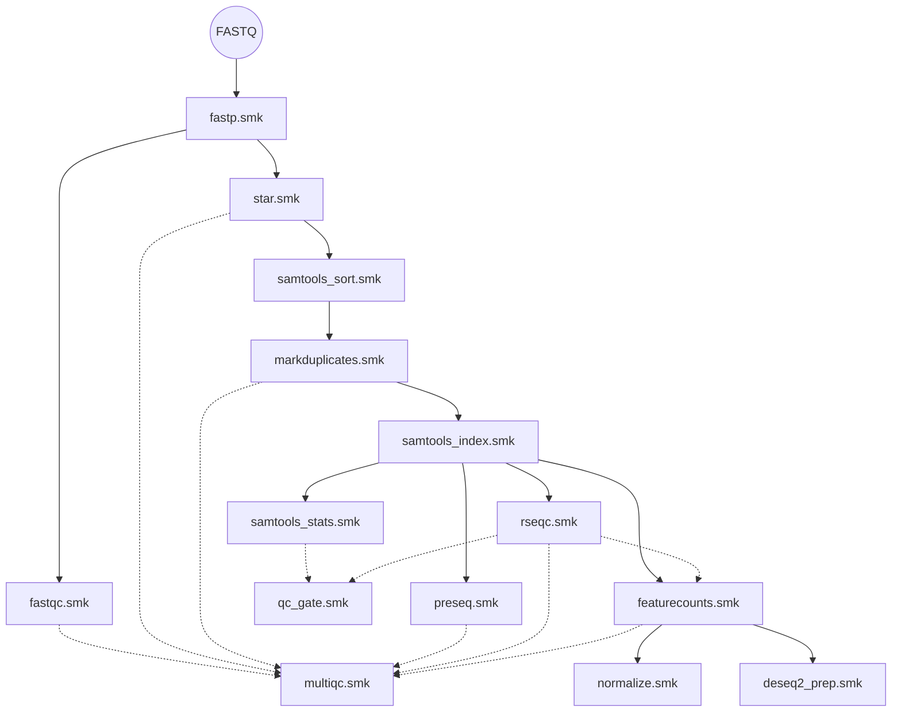

# Pipeline Rules

This directory contains the modular Snakemake rule files. Each `.smk` file wraps a single bioinformatics tool, isolating its execution context.

---

## Modular Rule DAG

---

## Rule Reference

### Preprocessing & Quality Control

| File | Bioinformatics Tool | Purpose |
|---|---|---|
| `fastp.smk` | `fastp` | Performs adapter trimming and quality filtering of raw reads |
| `fastqc.smk` | `FastQC` | Generates per-read quality metrics in HTML format |
| `preseq.smk` | `Preseq` | Estimates library complexity and predicted unique yields |
| `qc_gate.smk` | Custom Validator | Evaluates mapping rate, duplication rate, and reads against user thresholds |
| `multiqc.smk` | `MultiQC` | Combines QC logs from all tools into an interactive summary report |

### Alignment & BAM Post-processing

| File | Bioinformatics Tool | Purpose |
|---|---|---|
| `star.smk` | `STAR` | Performs splice-aware alignment against the reference genome |
| `samtools_sort.smk` | `samtools` | Coordinate-sorts BAM files |
| `markduplicates.smk` | `Picard` | Detects and marks PCR duplicate reads |
| `samtools_index.smk` | `samtools` | Indexes sorted and marked BAM files |
| `samtools_stats.smk` | `samtools` | Computes comprehensive alignment statistics |

### Quantification & Analytics

| File | Bioinformatics Tool | Purpose |
|---|---|---|
| `featurecounts.smk` | `featureCounts` | Counts reads mapped to genomic features, using auto-detected strandedness |
| `rseqc.smk` | `RSeQC` | Evaluates gene body coverage, read distribution, and strandedness inference |
| `normalize.smk` | Custom Python Script | Normalizes raw counts into FPKM and TPM matrices |
| `deseq2_prep.smk` | Custom Python Script | Performs VST-like log transform, PCA, and sample correlation |

### Helper Infrastructure

| File | Purpose |
|---|---|
| `resources.smk` | Dynamically allocates CPU, RAM, and runtime based on input file sizes and retries |
| `utils.smk` | General helpers, importing `get_conda_env` and auto-strandedness consensus functions |

---

## Modularity & Swappability (Contrast vs Monolithic)

Unlike monolithic pipelines where components are tightly coupled via direct script calls or shared configuration blocks, this rule directory operates on a strict **input/output contract**:
* **Alternative Alignment:** Swap `STAR` with `HISAT2` or `minimap2` by rewriting `star.smk`. As long as the output is a coordinate-sorted BAM, no downstream rules need to be modified.
* **Alternative Quantification:** Swap `featureCounts` for pseudo-aligners like `Salmon` or `Kallisto` by editing `featurecounts.smk` to output a gene count matrix.
* **Architecture Security:** This modularity protects the overall architecture from breaking during tool updates or algorithm changes.

For an interactive, editable visualization of the modular rule connections and dependency schema, see the Draw.io schematic:
* **[docs/architecture.drawio](../docs/architecture.drawio)**

---

## Developer Guidelines

1. **Strict Error Isolation:** Always use `set -euo pipefail` inside the `shell:` blocks.
2. **Logging:** Every rule must redirect standard output and standard error using the `log:` directive.
3. **Environment Sandboxing:** Never use shared Conda environments. Reference `get_conda_env` pointing to the corresponding environment YAML in `rules/envs/`.

