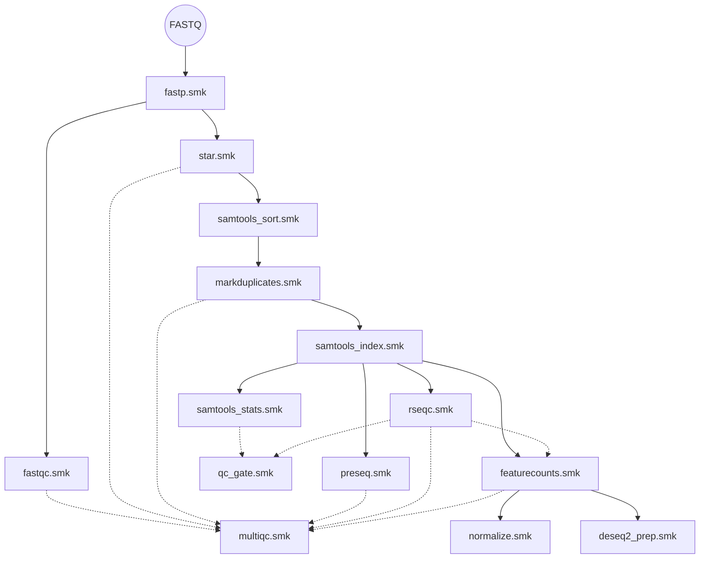

# Pipeline Rules

This directory contains the modular Snakemake rule files. Each `.smk` file wraps a single bioinformatics tool.

---

## DAG (Dependency Order)

---

## Rule Files

### Preprocessing & QC

| File | Tool | What it does |
|---|---|---|
| `fastp.smk` | fastp | Trim adapters, filter low-quality reads |
| `fastqc.smk` | FastQC | Generate per-read quality reports |
| `preseq.smk` | Preseq | Estimate library complexity |
| `qc_gate.smk` | Custom | Check mapping rate, duplication rate, total reads against thresholds. Flag samples as PASS/FAIL |
| `multiqc.smk` | MultiQC | Aggregate all QC logs into one HTML report |

### Alignment & BAM Processing

| File | Tool | What it does |
|---|---|---|
| `star.smk` | STAR | Splice-aware alignment to the reference genome |
| `samtools_sort.smk` | samtools | Coordinate-sort BAM files |
| `markduplicates.smk` | Picard | Mark PCR duplicates |
| `samtools_index.smk` | samtools | Create `.bai` index for random BAM access |
| `samtools_stats.smk` | samtools | Compute alignment statistics |

### Quantification & Analytics

| File | Tool | What it does |
|---|---|---|
| `featurecounts.smk` | Subread featureCounts | Count reads per gene. Uses auto-detected strandedness from RSeQC |
| `rseqc.smk` | RSeQC | Gene body coverage, read distribution, strandedness inference |
| `normalize.smk` | Custom Python | Compute FPKM and TPM from raw counts |
| `deseq2_prep.smk` | Custom Python | VST normalization, PCA, sample correlation matrix |

### Infrastructure

| File | What it does |
|---|---|
| `resources.smk` | Dynamic memory and time allocation functions. Scales with input size and retry count |
| `utils.smk` | Helper functions: `is_single_end()` and `get_consensus_strandedness()` |

---

## Design Rules

1. **`set -euo pipefail`** in every shell block. Fail immediately on any hidden error.
2. **One Conda env per rule.** Defined in `envs/`. No shared environments.
3. **All paths from `config.yaml`.** Nothing is hardcoded.
4. **All logs captured.** Every rule writes `stdout` and `stderr` to dedicated log files.
