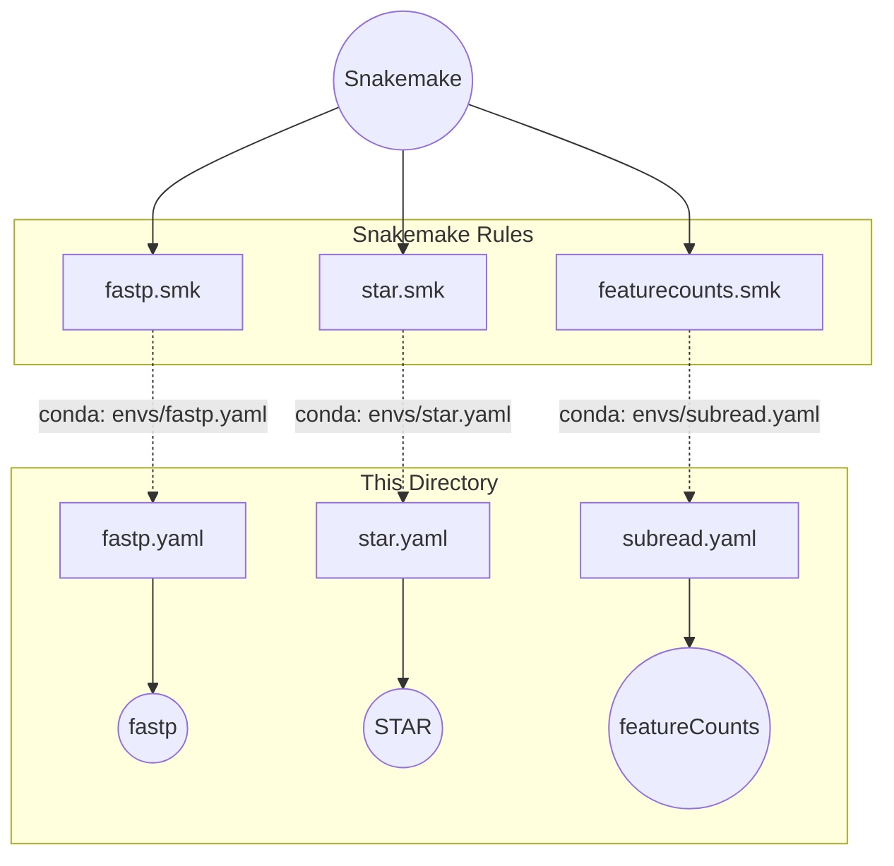

# Rule-Level Environments (Modular)

This directory contains strict **one-tool-per-file** Conda environments. Each YAML maps to exactly one `.smk` rule file.

---

## How It Works

Each `.smk` rule declares `conda: "envs/<tool>.yaml"`. Snakemake creates an isolated environment for that rule at runtime.

---

## File Reference

| YAML File | Tool | Used by |
|---|---|---|
| `fastp.yaml` | fastp | `rules/fastp.smk` |
| `fastqc.yaml` | FastQC | `rules/fastqc.smk` |
| `star.yaml` | STAR | `rules/star.smk` |
| `samtools.yaml` | samtools | `rules/samtools_sort.smk`, `samtools_index.smk`, `samtools_stats.smk` |
| `picard.yaml` | Picard | `rules/markduplicates.smk` |
| `subread.yaml` | Subread (featureCounts) | `rules/featurecounts.smk` |
| `rseqc.yaml` | RSeQC | `rules/rseqc.smk` |
| `preseq.yaml` | Preseq | `rules/preseq.smk` |
| `multiqc.yaml` | MultiQC | `rules/multiqc.smk` |
| `deseq2.yaml` | DESeq2 (R) | R differential expression scripts |
| `python.yaml` | pandas, numpy | `rules/scripts/` Python analytics |

---

## Design Rules

1. **One tool per file.** If `STAR` updates, it does not break `fastp`.
2. **Pin every version.** Example: `star=2.7.11b`, not just `star`.
3. **Channel order matters.** Always: `conda-forge` → `bioconda` → `defaults`.

> [!WARNING]
> Never put two unrelated bioinformatics tools in the same YAML file. If a rule needs two tools, split it into two rules.

---

## `envs/` vs `rules/envs/`

| Directory | Purpose |
|---|---|
| **`rules/envs/`** (this directory) | Used by Snakemake rules during pipeline execution. Strict, isolated, reproducible. |
| **`envs/`** (root) | Used by humans for interactive debugging in the terminal. Broader, less strict. |
