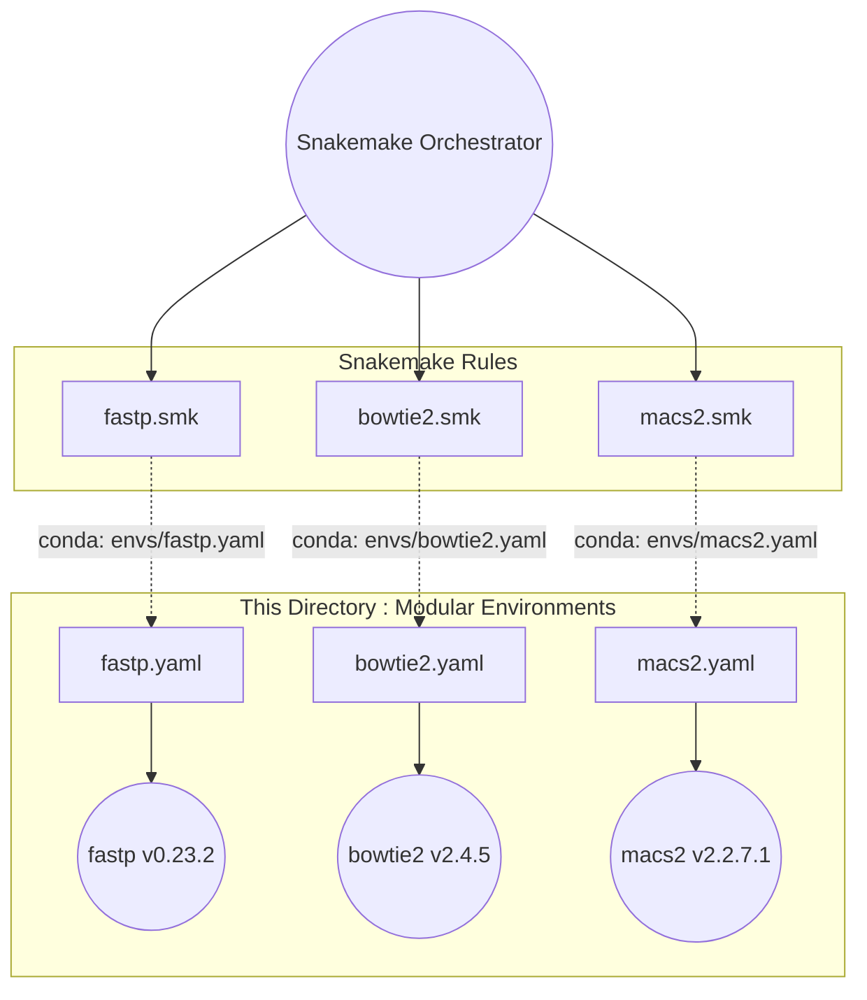

# Rule-Level Environments (Modular)

This directory contains strict **1-to-1 Modular Conda Environments**. Unlike the grouped environments in the root `envs/` directory, these YAML files are strictly mapped to single tools.

---

## 🏗️ Environment Architecture (Modular vs. Grouped)

---

## 🔒 Design Philosophy

We enforce strict isolation for Snakemake execution. 

1. **Isolation**: Every `.smk` rule requests exactly what it needs. If `bowtie2` updates, it will not break the environment for `fastp`.
2. **Reproducibility**: Every tool version is strictly pinned (e.g., `macs2=2.2.7.1`).
3. **Channel Priority**: All environments strictly enforce `conda-forge`, `bioconda`, and `defaults` in that precise order to prevent dependency conflicts.

> [!WARNING]
> Do not add multiple unrelated bioinformatics tools to a single YAML file in this directory. If a rule requires two disjoint tools, split the rule into two rules, or ensure the tools natively co-exist without dependency clashes in the same channel space.

---

## 📁 File Reference

Each file in this directory corresponds to a `.smk` rule in the parent `rules/` directory.

| YAML File | Primary Package | Downstream Consumer |
|---|---|---|
| `fastp.yaml` | `fastp` | `rules/fastp.smk` |
| `bowtie2.yaml` | `bowtie2` | `rules/bowtie2.smk` |
| `samtools.yaml` | `samtools` | `rules/samtools_sort.smk`, etc. |
| `picard.yaml` | `picard` | `rules/markduplicates.smk` |
| `macs2.yaml` | `macs2` | `rules/macs2.smk` |
| `python.yaml` | `pandas`, `numpy` | `scripts/` (Analytics hooks) |
| `deseq2.yaml` | `bioconductor-deseq2` | R Differential scripts |
