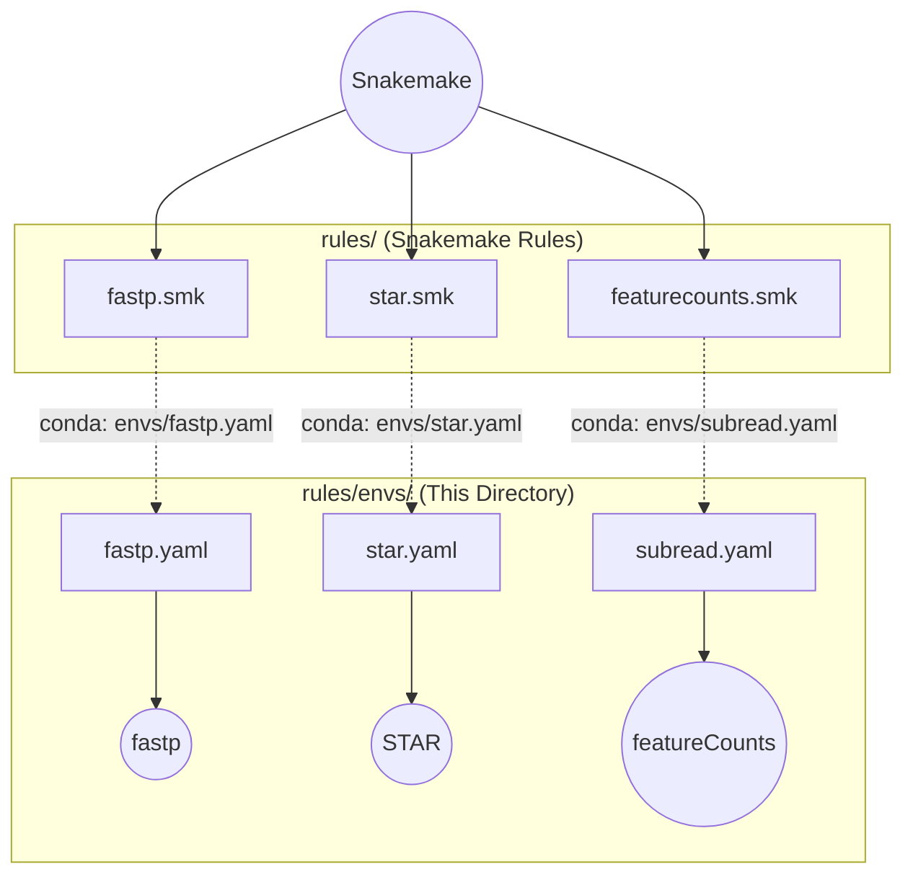

# Rule-Level Environments (Modular)

This directory contains strict **one-tool-per-file** Conda environments. Each YAML maps to exactly one `.smk` rule file.

---

## How It Works

Each `.smk` rule declares `conda: get_conda_env("envs/<tool>.yaml", workflow)`. Snakemake creates an isolated environment for that rule at runtime.

---

## File Reference

| YAML File | Tool | Main Executable | Used by |
|---|---|---|---|
| `fastp.yaml` | `fastp` | `fastp` | `rules/fastp.smk` |
| `fastqc.yaml` | `FastQC` | `fastqc` | `rules/fastqc.smk` |
| `star.yaml` | `STAR` | `STAR` | `rules/star.smk` |
| `samtools.yaml` | `samtools` | `samtools` | `rules/samtools_sort.smk`, `samtools_index.smk`, `samtools_stats.smk` |
| `picard.yaml` | `picard` | `picard` | `rules/markduplicates.smk` |
| `subread.yaml` | `subread` (featureCounts) | `featureCounts` | `rules/featurecounts.smk` |
| `rseqc.yaml` | `rseqc` | `infer_experiment.py`, `geneBody_coverage.py` | `rules/rseqc.smk` |
| `preseq.yaml` | `preseq` | `preseq` | `rules/preseq.smk` |
| `multiqc.yaml` | `multiqc` | `multiqc` | `rules/multiqc.smk` |
| `deseq2.yaml` | `deseq2` (R) | `Rscript` | Downstream differential expression |
| `python.yaml` | `pandas`, `numpy` | `python` | `rules/scripts/` Python analytics |

---

## Design Rules

1. **One tool per file:** If STAR is upgraded or replaced, it cannot break fastp or MultiQC.
2. **Strict pinning:** Always specify full version numbers (e.g., `star=2.7.11b` rather than `star`).
3. **Container Compatibility:** Make sure environments correspond to the version used in the container definitions (in rule files) for reproducibility across both local Conda and Singularity modes.

> [!WARNING]
> Never bundle multiple unrelated tools into the same YAML file. If a rule requires two separate binaries from different packages, divide it into two sequential rules.
