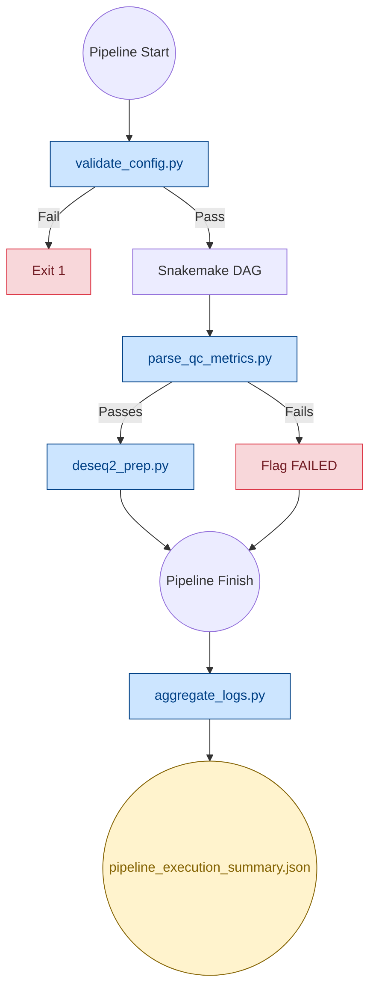
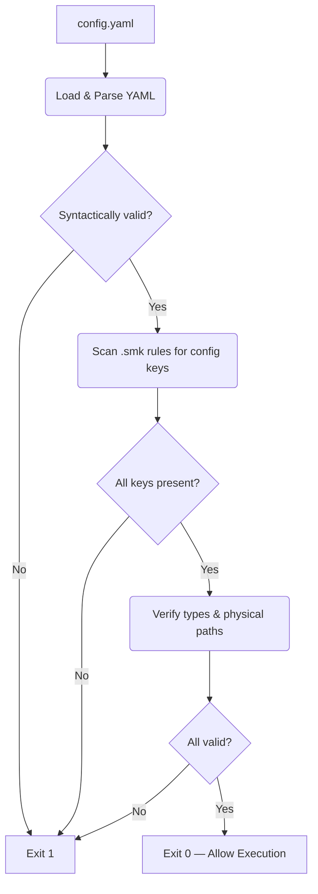
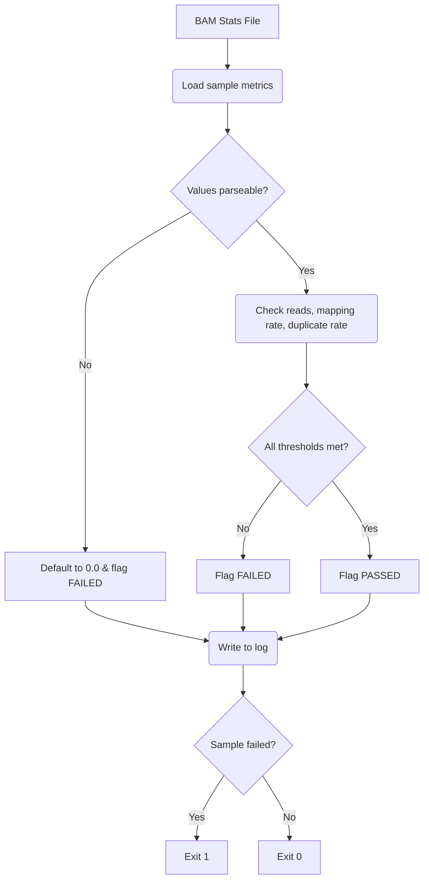
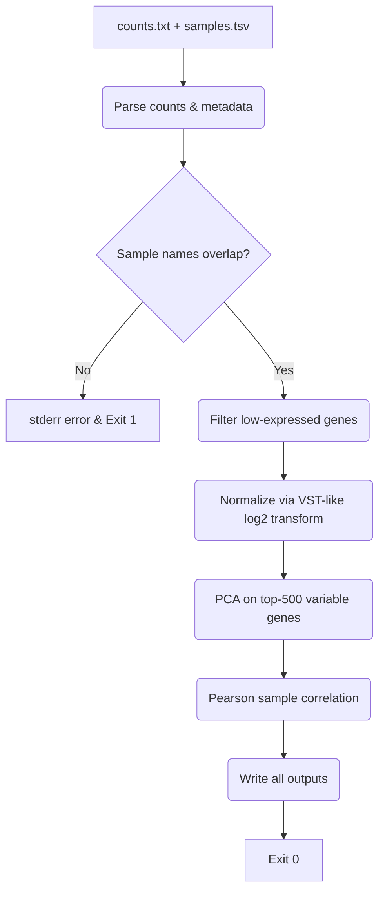
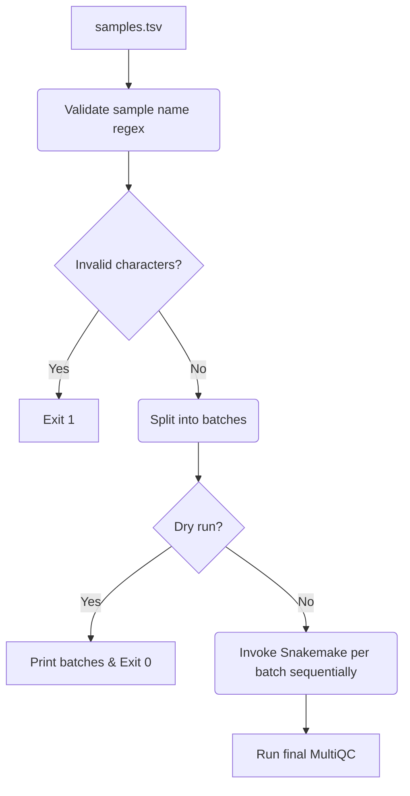
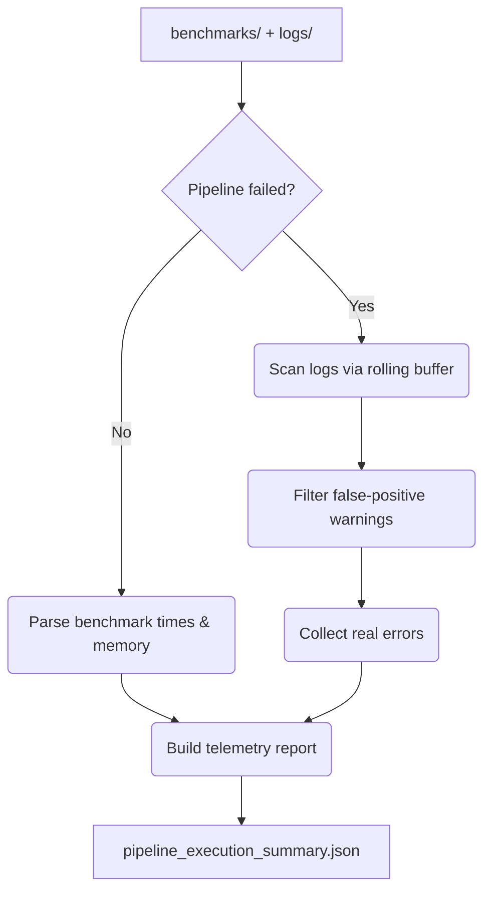
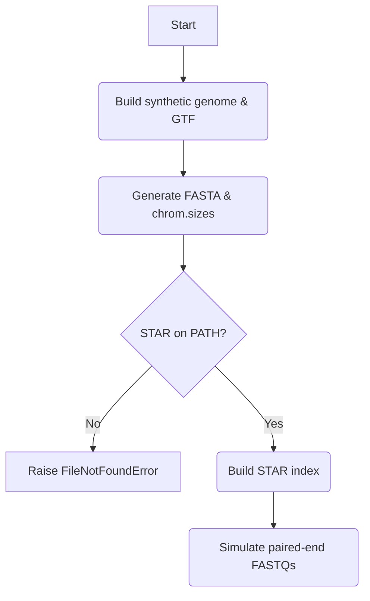

# Pipeline Scripts

Python utilities powering the RNA-seq pipeline's validation, QC, count matrix preparation, and telemetry.

---

## 🏗️ Integration Architecture

---

## 📁 Script Reference

| Script | When it Runs | Purpose |
|---|---|---|
| `validate_config.py` | Before DAG | Validates `config.yaml` keys, types, and physical paths before any job runs |
| `parse_qc_metrics.py` | After alignment | Checks total reads, mapping rate, and duplicate rate; flags samples that fail thresholds |
| `deseq2_prep.py` | After featureCounts | Normalizes counts (VST-like), computes PCA and sample correlation, writes dispersion estimates |
| `run_batched.py` | Manual invocation | Splits samples into batches for sequential Snakemake runs on memory-constrained machines |
| `aggregate_logs.py` | After completion | Collects benchmark and log data into a single JSON execution summary |
| `generate_test_data.py` | CI/CD only | Generates synthetic genomes, STAR indices, and paired-end FASTQs for automated testing |
| `test_validate_config.py` | CI/CD only | Unit tests for `validate_config.py` |

---

## 🔒 Fail-Safe Boundaries

| Script | Failure Scenario | Behavior |
|---|---|---|
| `parse_qc_metrics.py` | Metric parse failure | Defaults to `0.0`, flags sample as `FAILED` |
| `deseq2_prep.py` | Sample name mismatch between counts and sample sheet | Prints error to `stderr`, exits with code 1 |
| `deseq2_prep.py` | Division-by-zero in VST normalization | Stabilized with `+ 0.1` in variance denominator |
| `deseq2_prep.py` | Log-of-zero in rlog normalization | Stabilized with `+ alpha` before `log2` transform |

---

## 📊 Script Flowcharts

### 1. `validate_config.py` — Startup Validator

▶ Click to Expand

### 2. `parse_qc_metrics.py` — QC Gate

▶ Click to Expand

### 3. `deseq2_prep.py` — Count Matrix Processor

▶ Click to Expand

### 4. `run_batched.py` — Batch Orchestrator

▶ Click to Expand

### 5. `aggregate_logs.py` — Telemetry Aggregator

▶ Click to Expand

### 6. `generate_test_data.py` — CI/CD Synthetic Generator

▶ Click to Expand

