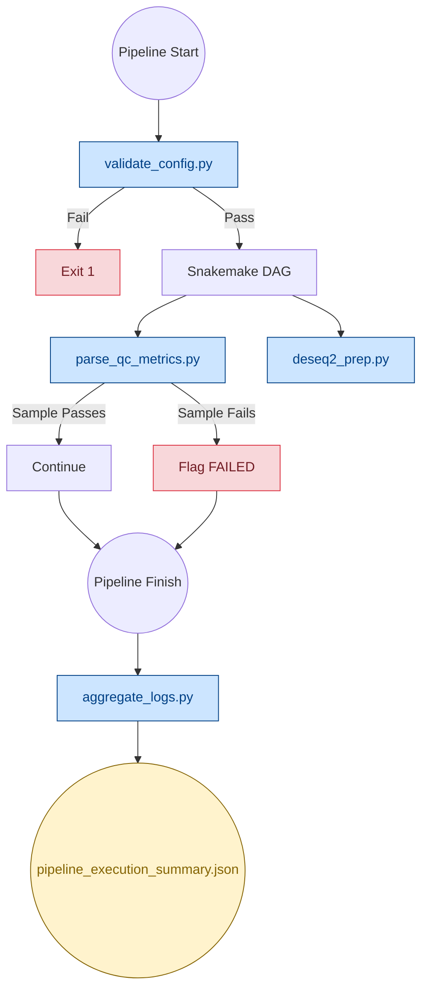
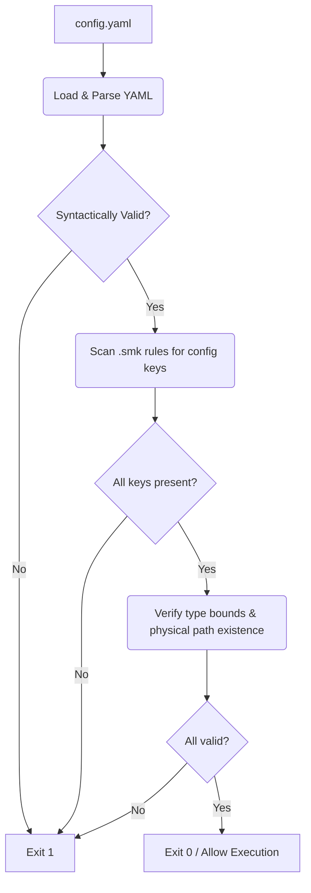
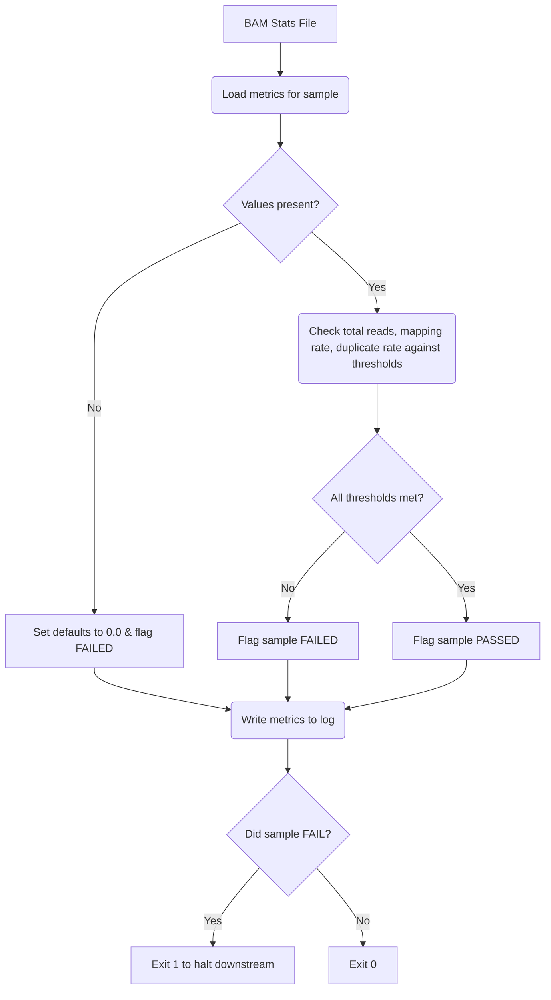
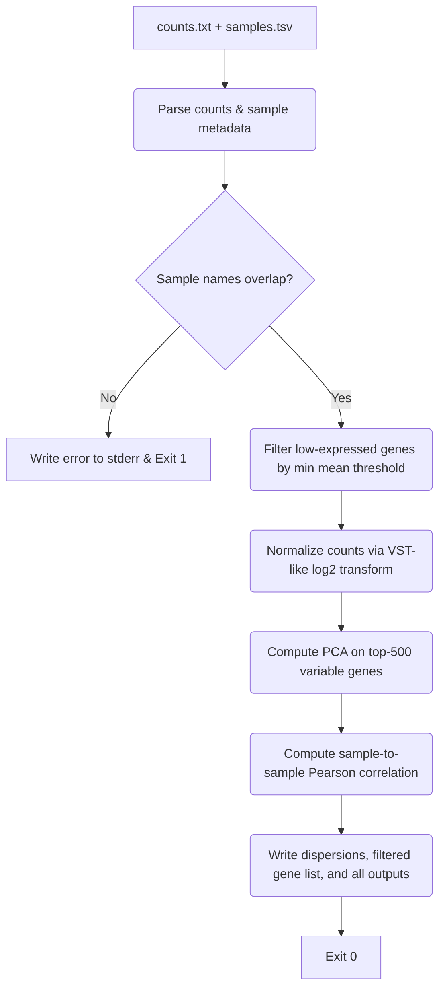
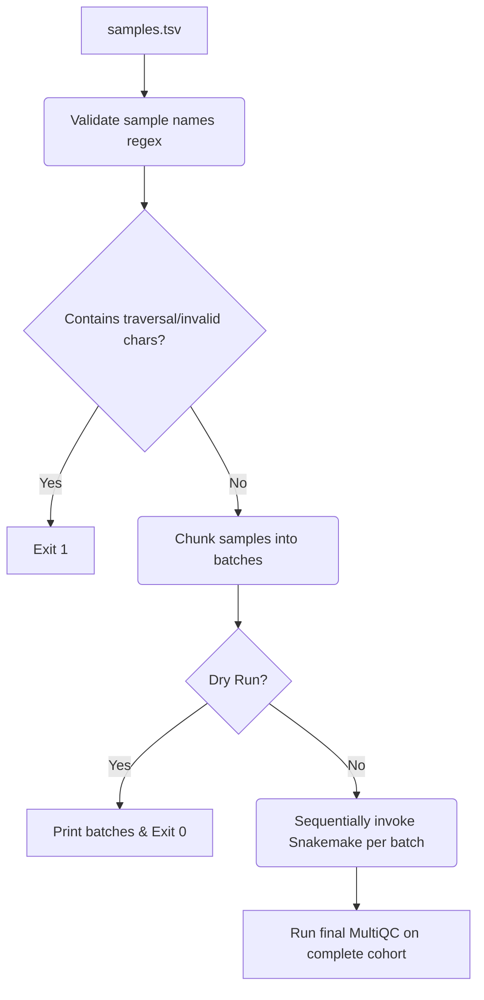
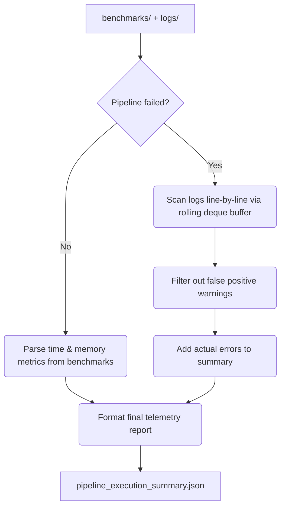
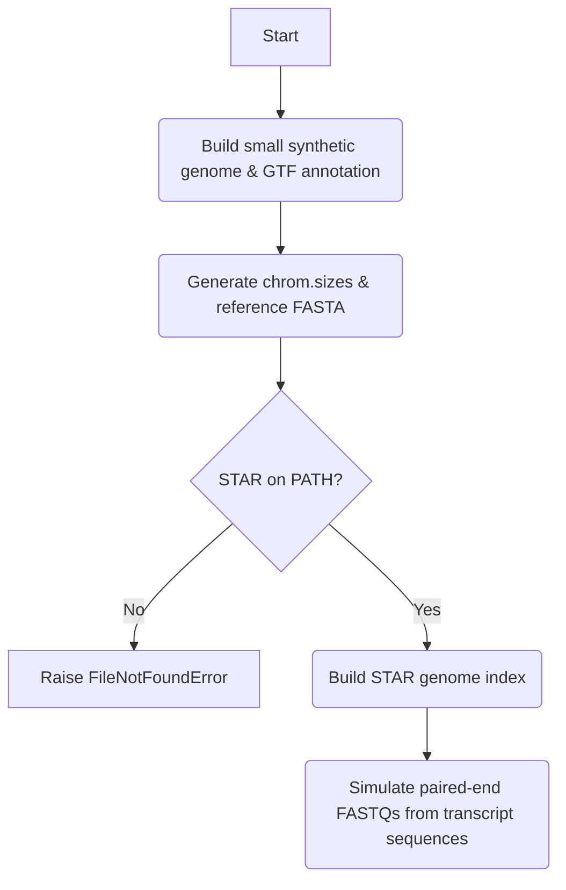

# Pipeline Scripts

Core Python utilities that power the RNA-seq pipeline's validation, quality control, count matrix preparation, and telemetry.

---

## 🏗️ Integration Architecture

---

## 📁 Script Reference

### Python Scripts

| Script | When it Runs | Purpose |
|---|---|---|
| `validate_config.py` | Before DAG | Scans `.smk` files for config references, verifies keys exist, checks scalar types, confirms physical files |
| `parse_qc_metrics.py` | After alignment | Evaluates total read count, mapping rate, and duplicate rate against thresholds; flags failures |
| `deseq2_prep.py` | After featureCounts | Normalizes count matrix (VST-like), computes PCA and sample correlation, writes dispersion estimates |
| `run_batched.py` | Manual invocation | Batches samples for sequential Snakemake execution on low-memory machines |
| `aggregate_logs.py` | After completion | Streams `benchmarks/` and `logs/` into a single JSON summary; filters false-positive errors |
| `generate_test_data.py` | CI/CD only | Builds synthetic reference genomes, STAR indices, GTF annotations, and paired-end FASTQs for automated testing |
| `test_validate_config.py` | CI/CD only | Unit tests for `validate_config.py` |

---

## 🔒 Fail-Safe Boundaries

Every analytic script implements defensive error handling to prevent a single bad sample from crashing a multi-day cohort run:

| Script | Failure Scenario | Behavior |
|---|---|---|
| `parse_qc_metrics.py` | Parse failure | Defaults metrics to `0.0`, flags sample as `FAILED` |
| `deseq2_prep.py` | No sample name overlap between counts and sample sheet | Writes error message to `stderr`, exits with code 1 |
| `deseq2_prep.py` | Division-by-zero in VST normalization | Stabilized with `+ 0.1` offset in variance denominator |
| `deseq2_prep.py` | Log-of-zero in rlog normalization | Stabilized with `+ alpha` offset before `log2` transform |

---

## 📊 Script Flowcharts

### 1. `validate_config.py` (Startup Validator)

▶ Click to Expand Flowchart

### 2. `parse_qc_metrics.py` (QC Gate)

▶ Click to Expand Flowchart

### 3. `deseq2_prep.py` (Count Matrix Processor)

▶ Click to Expand Flowchart

### 4. `run_batched.py` (Low-Resource Batch Orchestrator)

▶ Click to Expand Flowchart

### 5. `aggregate_logs.py` (Telemetry Aggregator)

▶ Click to Expand Flowchart

### 6. `generate_test_data.py` (CI/CD Synthetic Generator)

▶ Click to Expand Flowchart

