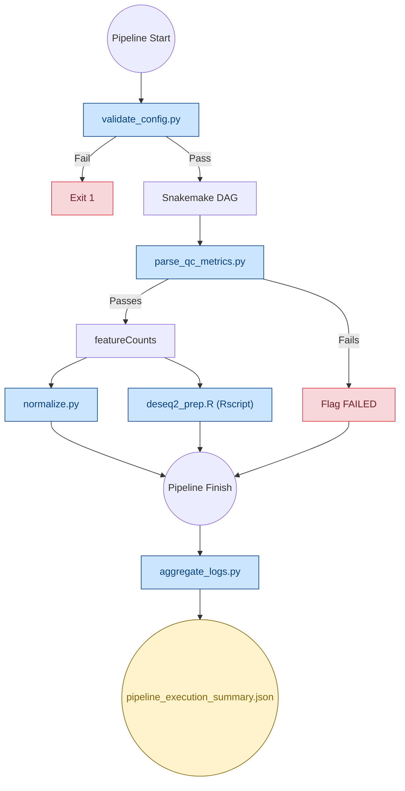

# Pipeline Scripts

Scripts and utilities for validation, QC gating, normalization, analytics, and CI/CD test data generation.

---

## How Scripts Fit into the Pipeline

---

## Script Reference

| Script | Language | Purpose | When It Runs |
|---|---|---|---|
| `validate_config.py` | Python | Validates YAML schema, key presence, structure, and required file paths | Before any jobs start |
| `conda_helper.py` | Python | Helper that dynamically returns the Conda environment or disables it (returning `None`) inside Singularity/Apptainer containers | During DAG compilation |
| `parse_qc_metrics.py` | Python | Parses alignment metrics and flags samples violating QC thresholds | After sorting/stats |
| `normalize.py` | Python | Converts raw gene counts into FPKM and TPM | After feature quantification |
| `deseq2_prep.R` | R | Performs biological Variance Stabilizing Transformation (VST), PCA, correlation, and dispersion estimation | After feature quantification |
| `run_batched.py` | Python | Splits samples into smaller batches to run sequentially on memory-limited machines | Standalone wrapper |
| `aggregate_logs.py` | Python | Parses and logs benchmark metrics to a JSON telemetry file | After run finishes |
| `generate_test_data.py` | Python | Simulates a synthetic genome, builds a STAR index, and generates paired-end/single-end reads | CI/CD testing only |
| `test_validate_config.py` | Python | Unit tests for configuration validation | CI/CD testing only |

---

## Fail-Safe Details

* **`validate_config.py`:** Hard-stops execution (exit code 1) on missing config entries or missing sample directories.
* **`conda_helper.py`:** Silently ignores `AttributeError` if Snakemake's API is missing attributes, checking the CLI arguments as a robust fallback.
* **`deseq2_prep.R`:** Implements robust error handling that falls back to `varianceStabilizingTransformation(fitType="mean")` if standard VST fails on small sample sizes.
* **`normalize.py`:** Safeguards against zero-length features or unmapped samples, writing `0.0` rather than raising division errors.

