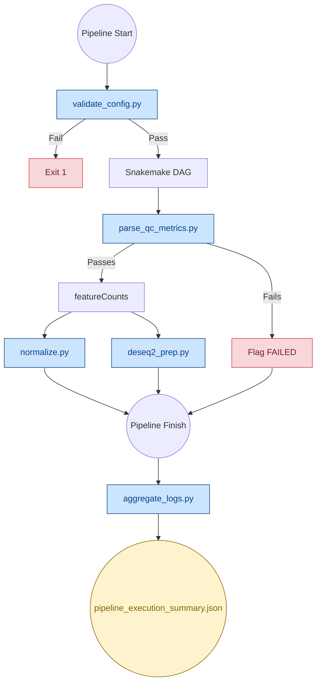
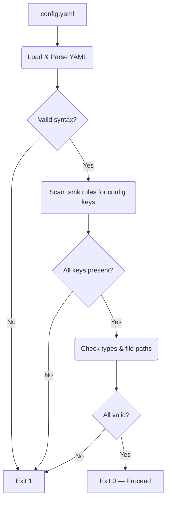
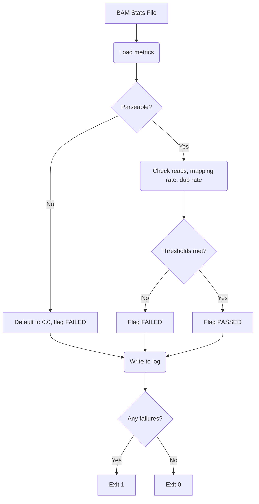
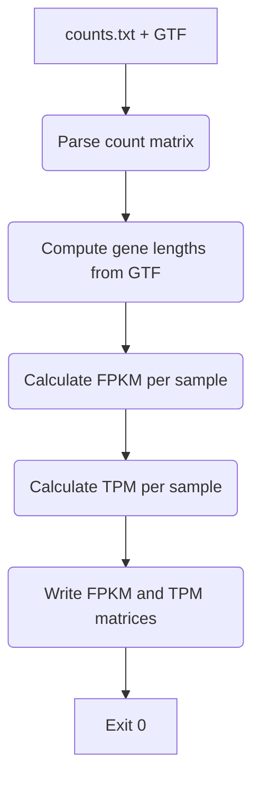
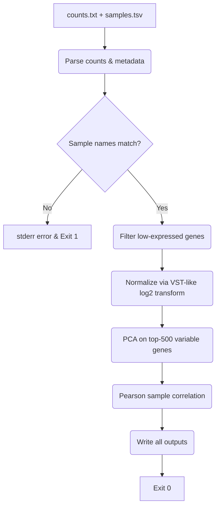
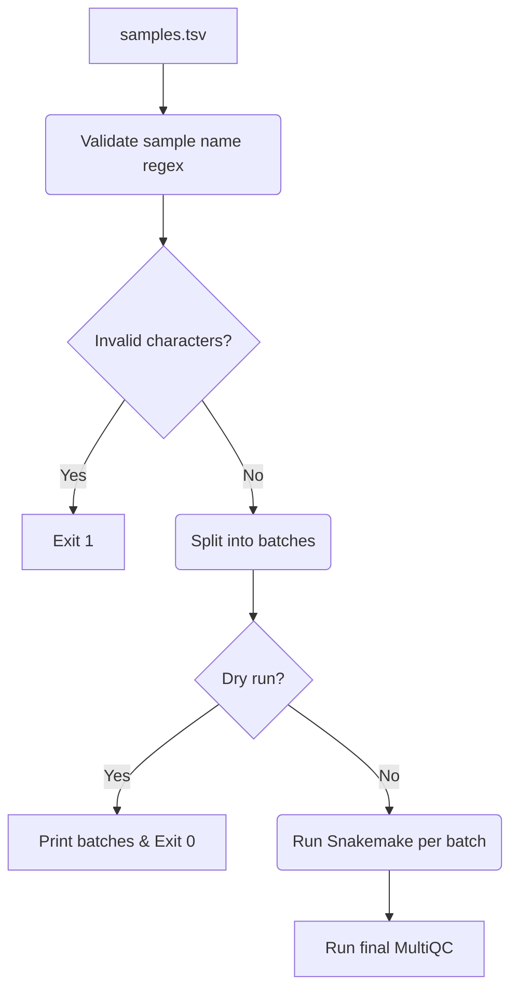
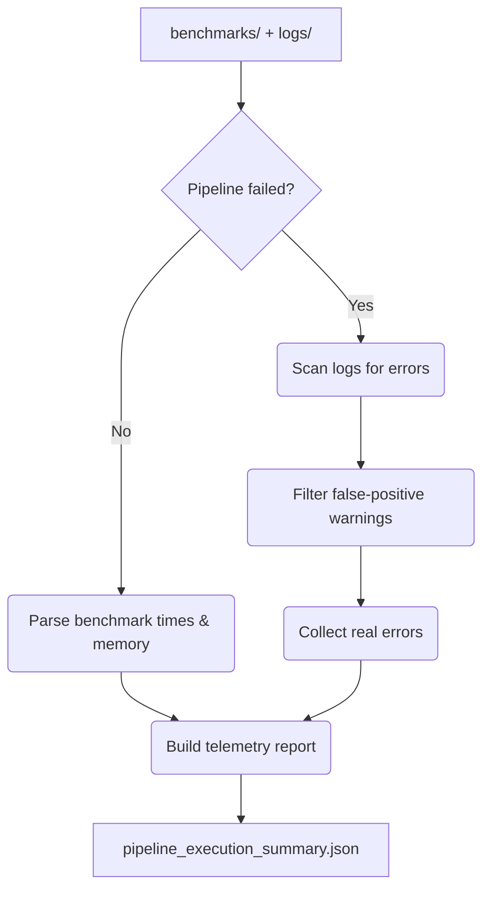
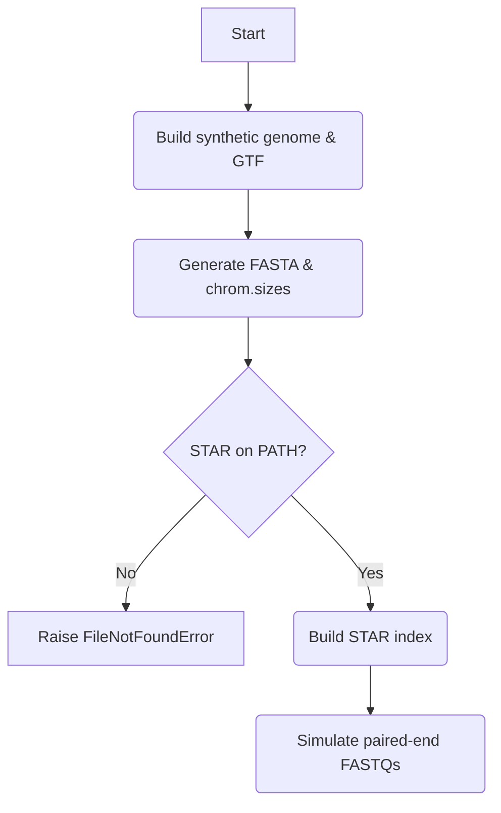

# Pipeline Scripts

Python utilities for validation, QC gating, normalization, analytics, and CI/CD test data generation.

---

## How Scripts Fit into the Pipeline

---

## Script Reference

| Script | When it runs | What it does |
|---|---|---|
| `validate_config.py` | Before DAG | Checks all `config.yaml` keys, types, and file paths exist |
| `parse_qc_metrics.py` | After alignment | Reads total reads, mapping rate, duplicate rate. Flags samples as PASS or FAIL |
| `normalize.py` | After featureCounts | Computes FPKM and TPM from the raw count matrix |
| `deseq2_prep.py` | After featureCounts | VST-like normalization, PCA on top-500 variable genes, Pearson correlation matrix |
| `run_batched.py` | Manual use | Splits samples into batches for sequential Snakemake runs on low-memory machines |
| `aggregate_logs.py` | After completion | Collects benchmark and log data into a single JSON summary |
| `generate_test_data.py` | CI/CD only | Creates synthetic genome, STAR index, and paired-end FASTQs for automated testing |
| `test_validate_config.py` | CI/CD only | Unit tests for `validate_config.py` |

---

## Fail-Safe Behavior

| Script | Failure case | What happens |
|---|---|---|
| `validate_config.py` | Missing key or invalid path | Exits with code 1 before any job runs |
| `parse_qc_metrics.py` | Cannot parse a metric value | Defaults to `0.0` and flags the sample as `FAILED` |
| `deseq2_prep.py` | No sample names match between counts and sample sheet | Prints error to stderr, exits with code 1 |
| `deseq2_prep.py` | Division by zero in VST normalization | Stabilized with `+ 0.1` in the variance denominator |
| `deseq2_prep.py` | Log of zero in rlog | Stabilized with `+ alpha` before the `log2` transform |
| `normalize.py` | Zero-length gene or zero library size | Writes `0.0` instead of crashing |

---

## Script Flowcharts

### 1. `validate_config.py`

▶ Click to expand

### 2. `parse_qc_metrics.py`

▶ Click to expand

### 3. `normalize.py`

▶ Click to expand

### 4. `deseq2_prep.py`

▶ Click to expand

### 5. `run_batched.py`

▶ Click to expand

### 6. `aggregate_logs.py`

▶ Click to expand

### 7. `generate_test_data.py`

▶ Click to expand

