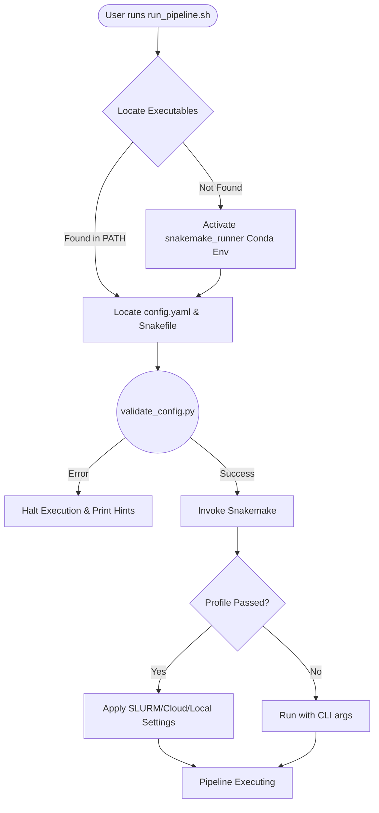

# Pipeline Execution Scripts

This directory contains the root-level Bash scripts responsible for bootstrapping, validating, and executing the pipeline.

---

## 🏗️ Execution Architecture



---

## 📁 Script Reference

| Script | Purpose |
|---|---|
| `run_pipeline.sh` | The primary entrypoint for the pipeline. Abstracts away environment activation and config validation. |
| `clean_result_files.sh` | *(Optional)* Recursively cleans up `results/`, `logs/`, and `benchmarks/` to force a complete re-run. |
| `directory_structure.sh` | *(Optional)* Bootstraps the output directory tree (mostly redundant as Snakemake auto-creates dirs). |

---

## ⚙️ `run_pipeline.sh` Options

By default, executing `scripts/run_pipeline.sh` uses 4 cores and `config.yaml`. 

You can modify its behavior with the following flags:

| Flag | Description | Example |
|---|---|---|
| `-c, --cores` | Set total CPU cores | `-c 16` |
| `-f, --config` | Provide a custom config path | `-f configs/test.yaml` |
| `-n, --dry-run` | Build the DAG without running jobs | `-n` |
| `--` | Pass arbitrary arguments to Snakemake | `-- --profile profiles/slurm` |

**Example of Cloud Execution:**
```bash
scripts/run_pipeline.sh -c 100 -- --profile profiles/gcp
```
