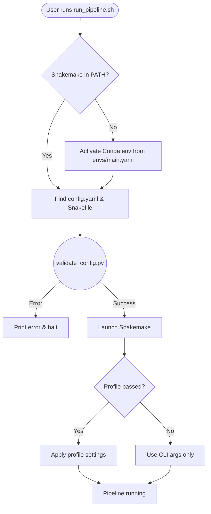

# Pipeline Execution Scripts

Bash wrappers that bootstrap, validate, and launch the pipeline.

---

## Execution Flow



---

## Scripts

| Script | What it does |
|---|---|
| `run_pipeline.sh` | Main entry point. Handles environment activation, config validation, and Snakemake launch. |
| `clean_result_files.sh` | Deletes `results/`, `logs/`, and `benchmarks/` to force a clean re-run. |
| `directory_structure.sh` | Creates the output directory tree. Mostly redundant since Snakemake auto-creates directories. |

---

## `run_pipeline.sh` Options

| Flag | What it does | Example |
|---|---|---|
| `-c, --cores` | Set CPU cores | `-c 16` |
| `-f, --config` | Custom config path | `-f configs/test.yaml` |
| `-n, --dry-run` | Build DAG without running jobs | `-n` |
| `--` | Pass extra args to Snakemake | `-- --profile profiles/slurm` |

### Examples

```bash
# Local run with 8 cores
scripts/run_pipeline.sh -c 8 -- --profile profiles/local

# Cloud run on GCP with 100 jobs
scripts/run_pipeline.sh -c 100 -- --profile profiles/gcp

# Dry run (no jobs executed)
scripts/run_pipeline.sh -n
```
